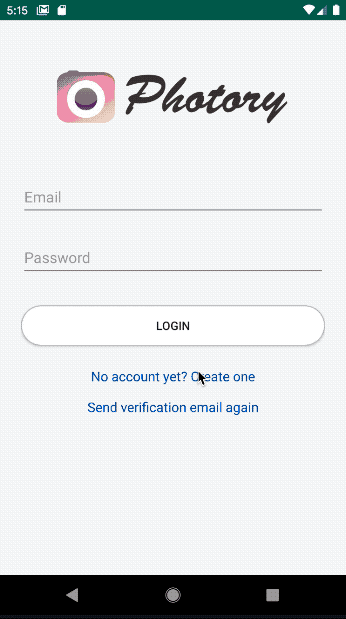
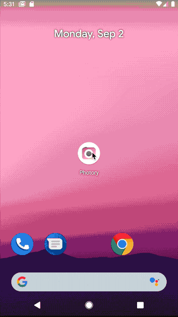

# *Photory / InstagramClone*

**InstagramClone** An android application clones the basic features of Instagram. I first follows [mitchtabian](https://github.com/mitchtabian/Android-Instagram-Clone/tree/24e82c30bfc64b474b08f64c304564cb626a2bfc)'s work, and then add some new features to the app, and make it a complete android application.

Time spent: 3 weeks spent in total

## Video Walkthrough

Here's a walkthrough of implemented user stories:

## User Stories

I use **Java** to compelete this Application. The following **required** functionality is completed:

* [X] User can **login** to his/her account.
* [X] User can **sign up** using the app, and the app will send them a verification email. After the user verify the email, then can launch the app.
* [X] User can **sign out** their account.
* [X] User can **edit** their profile photo and their information.
* [X] User can **share** their photos from photo gallery or from camera.
* [X] User can **search** other users, and follow them to see their posts.
* [X] User can **make comments** to any posts and **reply** to other comments.
* [X] User can **like posts and comments**.
* [X] User can click any user's profile photo or their username to see their profile.
* [X] User can see the news of their followings.
* [X] User can see who liked their posts.

The following features are implemented:

* [X] Use **BottomNavigationView** to navigate between different activities.
* [X] Use **FragmentPagerAdapter** to navigate between ViewPagers.
* [X] Use **Toolbar** to set the TextView and menu in ProfileActivity.
* [X] Use **Universal image loader** to load the web image.
* [X] Use **Firebase** as the backend.
* [X] Use **RecyclerView ListView GridView**.
* [X] Use **ViewPager** to set fragments.
* [X] Add animations when **navigating** between activities.
* [X] Use **circleimageview**.

## Open-source libraries used

- BottomNavigationViewEx library
- Circle ImageView
- Universal image loader
- firebase

## License

    Copyright 2019 Yini Duanmu

    Licensed under the Apache License, Version 2.0 (the "License");
    you may not use this file except in compliance with the License.
    You may obtain a copy of the License at

        http://www.apache.org/licenses/LICENSE-2.0

    Unless required by applicable law or agreed to in writing, software
    distributed under the License is distributed on an "AS IS" BASIS,
    WITHOUT WARRANTIES OR CONDITIONS OF ANY KIND, either express or implied.
    See the License for the specific language governing permissions and
    limitations under the License.